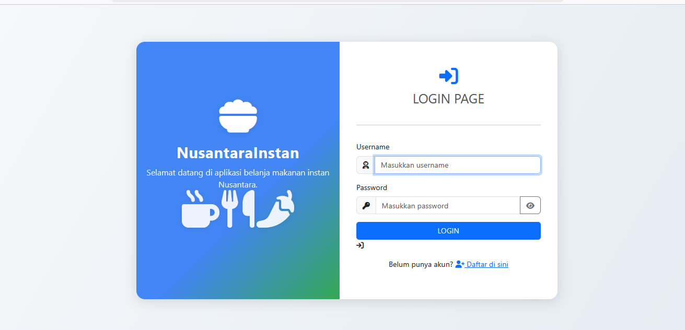
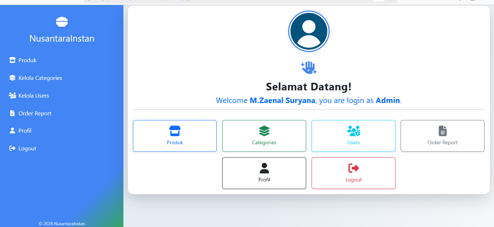
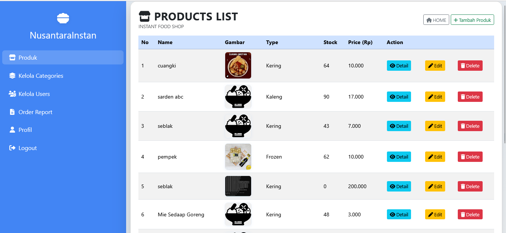
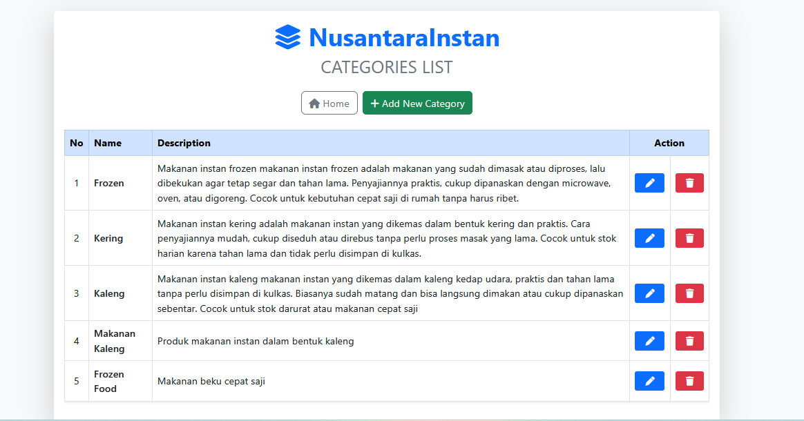
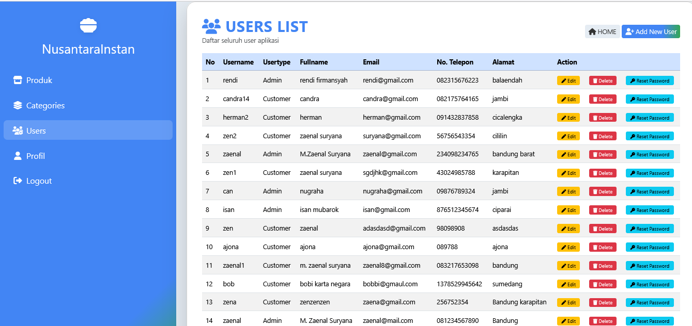
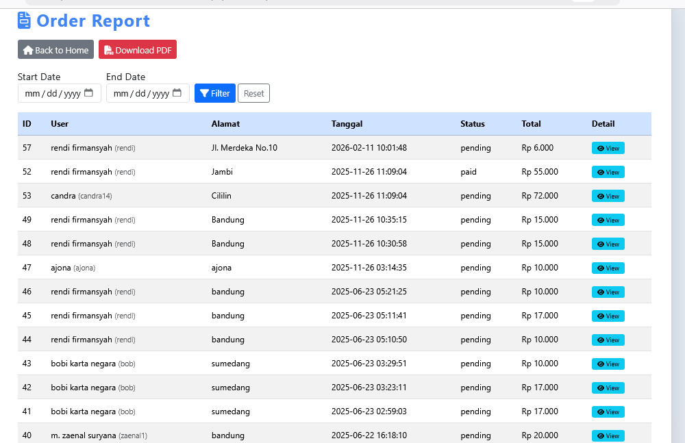
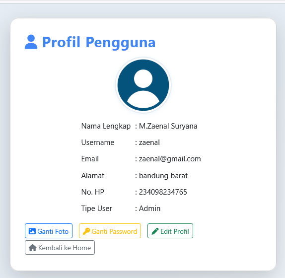
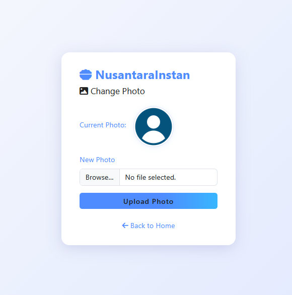
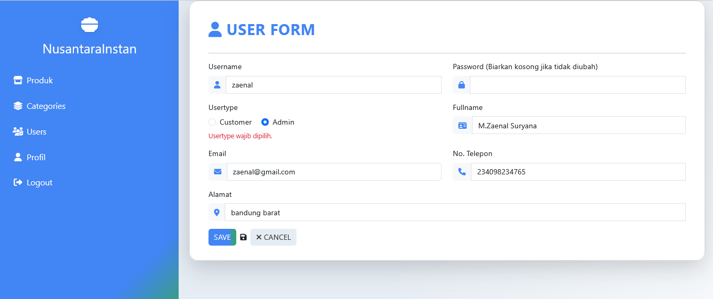
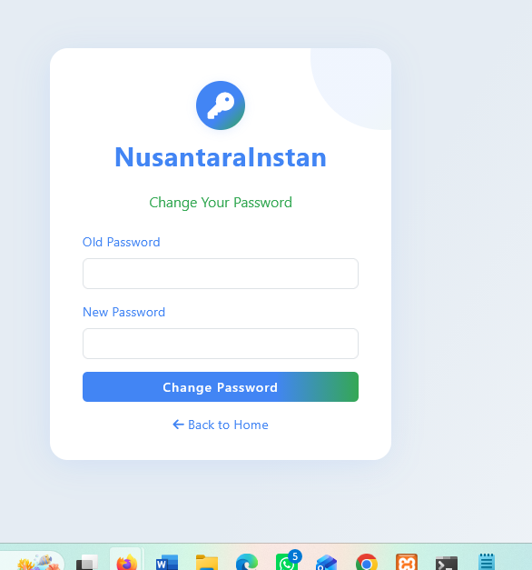

# NusantaraInstan

Aplikasi berbasis web untuk mengelola produk, kategori, pengguna, dan pesanan. Sistem ini dilengkapi dengan fitur autentikasi pengguna, manajemen data, laporan, serta pengelolaan profil akun.

## Fitur

### Autentikasi
- Login pengguna
- Logout pengguna

### Dashboard
- Ringkasan informasi sistem
- Navigasi ke seluruh modul aplikasi

### Manajemen Produk
- Menampilkan daftar produk
- Menambah produk
- Mengubah data produk
- Menghapus produk
- Melihat detail produk

### Manajemen Kategori
- Menampilkan daftar kategori
- Menambah kategori
- Mengubah kategori
- Menghapus kategori

### Manajemen Pengguna
- Menampilkan daftar pengguna
- Menambah pengguna
- Mengubah data pengguna
- Menghapus pengguna
- Reset password pengguna

### Manajemen Pesanan
- Pengelolaan data pesanan
- Laporan pesanan

### Profil
- Menampilkan biodata pengguna
- Mengubah informasi profil

## Teknologi yang Digunakan

- PHP Native
- MySQL
- Bootstrap
- HTML
- CSS
- JavaScript
- XAMPP

## Cara Menjalankan

1. Clone repository ini
2. Import database ke MySQL melalui phpMyAdmin
3. Jalankan Apache dan MySQL pada XAMPP
4. Simpan project pada folder `htdocs`
5. Akses melalui browser:

   http://localhost/nusantarainstan

## Screenshot

## Screenshot

### Halaman Login

### Dashboard

### produk list

### Kategories Lis

### Users

### Order report

### Profil

### unggah photo

### user form

### ganti pasword

